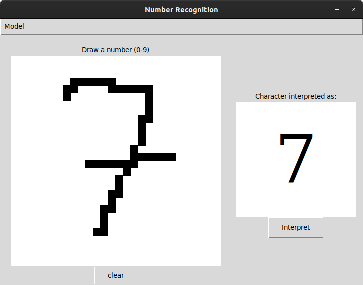
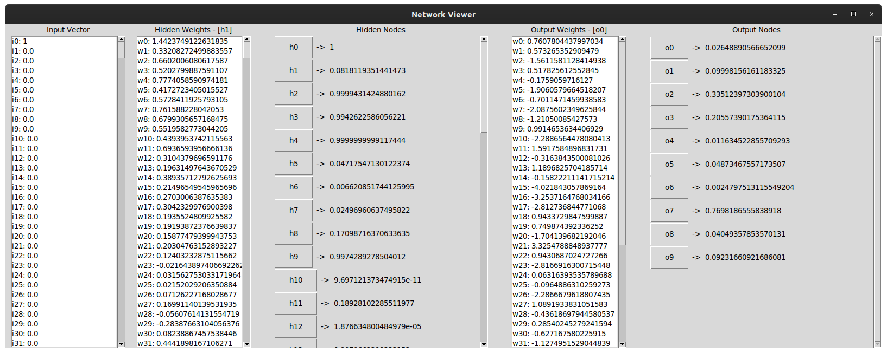

# hand-drawn-number-recognition-app
 Written by Nicholas Passantino  

Uses a neural network to interpret characters drawn by the user on a 28x28 canvas.  
[]  

The neural network was coded and trained from scratch using character sets taken from the MNIST hand-drawn digit database. These character sets were used to generate larger sets for the network to train and test on. This project also contains the scripts for building, training, and testing new networks.  

The application includes a window for viewing the topology of the neural network, and the values of the weights each node has.  

[]  

The algorithm used to train the network was a form of backpropegation(https://en.wikipedia.org/wiki/Backpropagation). The specific algorithm used was taken from the BACKPROPEGATION algorithm described in *Mitchell, Tom M. Machine Learning. 1997.*  

To launch the main application, run the NumRegApp.py script.

Special thanks to Josh Standerfer for his help in making my neural network's design more effective and efficient. His Github can be found here(https://github.com/CptnYankee).
